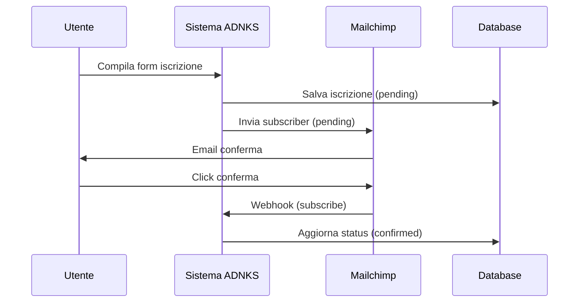

# 🚀 ADNKS - Guida Configurazione Mailchimp Double Opt-in

## 📋 Panoramica Integrazione

L'integrazione Mailchimp è stata implementata per gestire il **double opt-in** nelle iscrizioni agli eventi:

1. **Iscrizione Utente** → Salvataggio database (status: `pending`)
2. **Invio a Mailchimp** → Email di conferma automatica
3. **Conferma Utente** → Click nel link di conferma
4. **Webhook Callback** → Aggiornamento automatico status (`confirmed`)

## 🔧 Configurazione Iniziale

### 1. Database Migration

Esegui la migrazione per aggiungere i campi Mailchimp:

```bash
mysql -u root -p app_database < sql/mailchimp_migration.sql
```

**Campi aggiunti:**
- `Iscrizione_Eventi.mailchimp_id` - ID univoco Mailchimp
- `Iscrizione_Eventi.mailchimp_status` - Status sincronizzato
- `Iscrizione_Eventi.mailchimp_synced_at` - Timestamp sync
- Tabelle log per audit e webhook

### 2. Configurazione Mailchimp

#### A. Ottieni Credenziali API

1. Vai su **Mailchimp** → Account → Extras → **API keys**
2. Crea una nuova API key
3. Prendi nota del **datacenter** (es: `us1`, `us2`, ecc.)

#### B. Configura Lista Mailchimp

1. Crea una nuova **Audience/List** per gli eventi
2. Abilita **Double opt-in** nelle impostazioni lista
3. Personalizza l'email di conferma (opt-in confirmation)
4. Prendi nota dell'**List ID** dalla lista

#### C. Aggiorna File .env

```env
# Configurazione Mailchimp
MAILCHIMP_API_KEY=your_actual_api_key_here
MAILCHIMP_LIST_ID=your_list_id_here
MAILCHIMP_WEBHOOK_SECRET=your_generated_secret_here
MAILCHIMP_SERVER_PREFIX=us1
```

### 3. Configurazione Webhook

#### A. URL Webhook
Il webhook deve puntare a: `https://yourdomain.com/mailchimp_webhook.php`

#### B. Configurazione in Mailchimp

1. Vai su **Audience** → **Manage Contacts** → **Settings** → **Webhooks**
2. Aggiungi nuovo webhook con URL: `https://adnks.site/mailchimp_webhook.php`
3. Abilita eventi:
   - ✅ **Subscribes** (conferme iscrizione)
   - ✅ **Unsubscribes** (disiscrizioni)
   - ✅ **Profile Updates** (aggiornamenti profilo)
   - ✅ **Cleaned Addresses** (email respinte)
4. Imposta un **webhook secret** sicuro

#### C. Test Webhook (Automatico)

Il sistema include una funzione per configurare automaticamente il webhook:

```php
// Esempio test setup
require_once 'classes/MailchimpService.php';
$mailchimp = new MailchimpService();
$result = $mailchimp->setupWebhook('https://adnks.site/mailchimp_webhook.php');
```

## 🔄 Workflow Operativo

### Flusso Iscrizione Normale



### Stati del Sistema

| Database Status | Mailchimp Status | Descrizione |
|----------------|------------------|-------------|
| `pending` | `pending` | In attesa conferma email |
| `confirmed` | `subscribed` | Partecipazione confermata |
| `cancelled` | `unsubscribed` | Annullata dall'utente |
| `bounced` | `cleaned` | Email non valida |

## 🧪 Testing e Debugging

### 1. Test Iscrizione Manuale

1. Compila form iscrizione con email valida
2. Controlla log sistema: `/var/log/nginx/error.log` o Docker logs
3. Verifica database: tabella `Iscrizione_Eventi`
4. Controlla email di conferma Mailchimp
5. Click conferma e verifica webhook

### 2. Log di Debug

```bash
# Log sistema generale
tail -f /var/log/php_errors.log

# Log container Docker
docker compose logs -f php

# Query debug database
SELECT ie.*, u.email, e.nome
FROM Iscrizione_Eventi ie
JOIN Utenti u ON ie.idUtente = u.ID
JOIN Eventi e ON ie.idEvento = e.ID
WHERE ie.mailchimp_id IS NOT NULL
ORDER BY ie.createdAt DESC;
```

### 3. Test Webhook Endpoint

```bash
# Test webhook endpoint diretto
curl -X POST https://adnks.site/mailchimp_webhook.php \
  -H "Content-Type: application/x-www-form-urlencoded" \
  -d "type=subscribe&data[email]=test@example.com&data[id]=abc123&data[status]=subscribed"
```

### 4. Verifica Log Webhook

```sql
-- Log eventi webhook
SELECT * FROM Mailchimp_Webhook_Log
ORDER BY received_at DESC LIMIT 10;

-- Log cambi status
SELECT * FROM Iscrizione_Eventi_Log
WHERE source LIKE 'mailchimp%'
ORDER BY changedAt DESC LIMIT 10;
```

## ⚠️ Troubleshooting

### Problemi Comuni

#### 1. **API Key Non Funziona**
- ✅ Verifica API key corretta
- ✅ Controlla datacenter prefix (us1, us2, etc.)
- ✅ Verifica permessi API key

#### 2. **Webhook Non Ricevuto**
- ✅ URL webhook pubblicamente accessibile
- ✅ Certificato SSL valido
- ✅ Controlla firewall/proxy
- ✅ Verifica signature webhook (se abilitata)

#### 3. **Email Conferma Non Arriva**
- ✅ Controlla spam/promotional folder
- ✅ Verifica double opt-in abilitato su lista
- ✅ Controlla template email di conferma
- ✅ Verifica domain reputation

#### 4. **Status Non Si Aggiorna**
- ✅ Controlla log webhook: `Mailchimp_Webhook_Log`
- ✅ Verifica matching email nel database
- ✅ Controlla log errori PHP
- ✅ Verifica transazioni database

### Comandi Diagnostici

```php
// Test connessione Mailchimp
$mailchimp = new MailchimpService();
$result = $mailchimp->getSubscriber('test@example.com');
var_dump($result);

// Statistiche Mailchimp
$stats = $pdo->query("SELECT GetMailchimpStats()")->fetchColumn();
echo $stats;

// Resync manuale (se necessario)
$result = $mailchimp->updateSubscriber(
    'user@email.com', 'Nome', 'Cognome', 'Azienda', 'Evento', '2025-10-01'
);
```

## 📊 Monitoraggio

### Dashboard Metriche

Il sistema traccia automaticamente:

- ✅ **Tasso di conferma** (confirmed/pending ratio)
- ✅ **Bounce rate** (email non valide)
- ✅ **Tempo medio conferma** (pending → confirmed)
- ✅ **Errori integrazione** (API failures)

### Query Utili

```sql
-- Tasso di conferma per evento
SELECT
    e.nome,
    COUNT(*) as totale,
    SUM(CASE WHEN ie.status = 'confirmed' THEN 1 ELSE 0 END) as confermate,
    ROUND(SUM(CASE WHEN ie.status = 'confirmed' THEN 1 ELSE 0 END) * 100.0 / COUNT(*), 2) as tasso_conferma
FROM Iscrizione_Eventi ie
JOIN Eventi e ON ie.idEvento = e.ID
WHERE ie.createdAt >= DATE_SUB(NOW(), INTERVAL 30 DAY)
GROUP BY e.ID, e.nome
ORDER BY tasso_conferma DESC;

-- Problemi sincronizzazione
SELECT ie.*, u.email, e.nome as evento
FROM Iscrizione_Eventi ie
JOIN Utenti u ON ie.idUtente = u.ID
JOIN Eventi e ON ie.idEvento = e.ID
WHERE ie.mailchimp_id IS NULL
   OR (ie.status = 'pending' AND ie.mailchimp_status = 'subscribed')
ORDER BY ie.createdAt DESC;
```

## 🔐 Sicurezza

### Best Practices

1. **API Key Security**
   - Mai committare API key nel codice
   - Usa variabili ambiente (.env)
   - Rota periodicamente le key

2. **Webhook Security**
   - Imposta sempre webhook secret
   - Verifica signature nei webhook
   - Filtra IP sorgente (Mailchimp IPs)

3. **Data Privacy**
   - Rispetta GDPR per dati personali
   - Implementa right-to-be-forgotten
   - Log audit per modifiche dati

## 🚀 Messa in Produzione

### Checklist Pre-Deploy

- [ ] ✅ Database migrated
- [ ] ✅ .env configurato con credenziali reali
- [ ] ✅ Webhook configurato e testato
- [ ] ✅ SSL certificate valido
- [ ] ✅ Double opt-in test completato
- [ ] ✅ Log monitoring abilitato
- [ ] ✅ Backup database configurato

### Monitoring Post-Deploy

```bash
# Cron job per monitoring (esempio)
# */15 * * * * /usr/bin/php /path/to/adnks/src/scripts/mailchimp_health_check.php

# Alerte per:
# - Webhook non ricevuti > 1 ora
# - API errors > 5%
# - Pending iscrizioni > 24 ore
```

---

## 📞 Supporto

Per problemi o domande:
- 📧 **Email**: t.iordache@outlook.it
- 🌐 **Sistema**: https://adnks.site
- 📚 **Documentazione**: [Mailchimp API Docs](https://mailchimp.com/developer/marketing/api/)

---

*Documentazione aggiornata: Settembre 2025*


## file utili all'API finale:
- /classes.*
- event_checkin_update.php
- event_list_checkin.php
- event_registration.php
- mailchimp_webhook.php
- .env ?
- salva_evento.php -> gli eventi dovrebbero essere già caricati su WP dal FE

